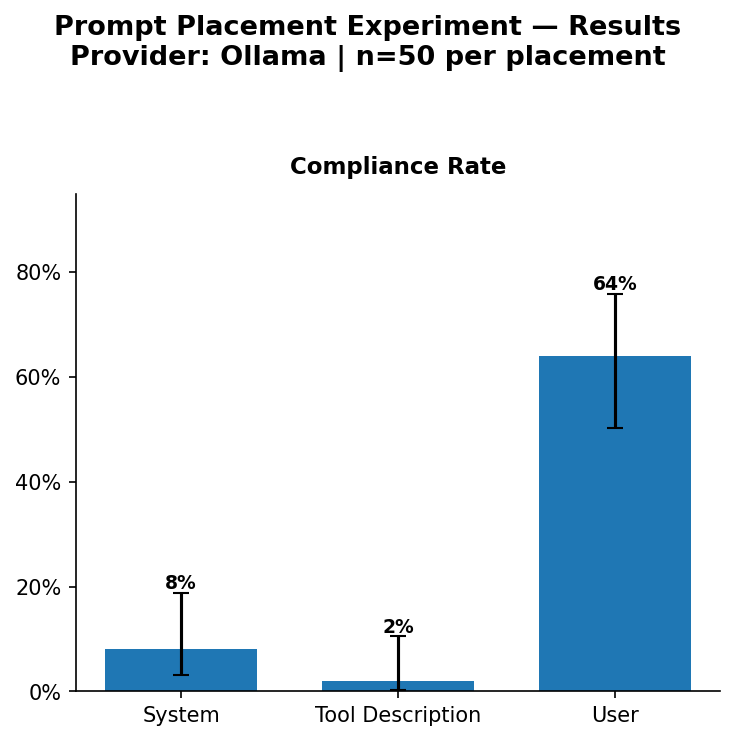

## Experiment Series

| Phase | What it measures | README |
|---|---|---|
| **Phase 1 — Placement Strength** | How instruction placement across slots affects compliance in isolation | *(this file)* |
| **Phase 2 — Hierarchy Resolution** | Which slot wins when all three conflict simultaneously | [README-phase2.md](README-phase2.md) |

---

# Prompt Placement Anatomy — Placement Experiment

This project runs a controlled experiment measuring how placing the same instruction in different **prompt slots** — system message, user message, and tool description — affects an LLM agent's behaviour in an agentic tool-use loop. The instruction under test is `"End your final answer with the marker [DONE]"`, and the agent's task is to count TODO markers across five markdown files using filesystem tools. We measure **compliance rate** (did the model follow the instruction?), **completion rate** (did it finish within the turn cap?), **turns to completion**, and **total token usage** — giving a quantitative signal on which structural slot carries the most instructional weight for a given model.

---

## Quickstart — Ollama (local)

> **Important:** All commands must be run from the root directory of the repository. The agent resolves `data/sample_files/` relative to your working directory.

> **Requires Python >= 3.10.** Earlier versions will fail on the `match` syntax and union type hints used throughout the codebase.

```bash
# 1. Install Ollama and make sure it is running
#    https://ollama.com/download
ollama serve   # if not already running as a background service

# 2. Pull the default model
ollama pull qwen2.5-coder:3b

# 3. Install Python dependencies
uv sync

# 4. Copy the environment template and set your values
cp .env.example .env   # on Windows: Copy-Item .env.example .env

# 5. Generate the five sample markdown files
python -m prompt_placement_anatomy.generate_data

# 6. Smoke-test the pipeline (1 run per placement = 3 runs total)
python -m prompt_placement_anatomy.runner --smoke-test

# 7. Run the full experiment (50 runs × 3 placements = 150 runs)
python -m prompt_placement_anatomy.runner

# 8. Analyse results and generate the chart
python -m prompt_placement_anatomy.analyze
```

Results are written to `results/runs.csv` and the chart to `results/chart.png`.

---

## Validation — Anthropic Claude

```bash
# 1. Install the Anthropic SDK (optional dependency)
uv sync --extra anthropic

# 2. Set provider and API key in .env
#    Copy .env.example → .env and fill in:
#      LLM_PROVIDER=anthropic
#      ANTHROPIC_API_KEY=sk-ant-...

# 3. Run validation trials (20 runs × 3 placements = 60 runs)
python -m prompt_placement_anatomy.runner

# 4. Analyse — shows both providers side by side
python -m prompt_placement_anatomy.analyze
```

---

## Notes

### Resumable runner

The runner is **safe to interrupt and re-run**. On startup it reads `results/runs.csv` and skips any `(provider, placement, run_id)` tuple already recorded. Partial progress is preserved — each row is flushed to disk immediately after the run completes.

### Stable prefill measurements (Ollama)

Set `OLLAMA_KEEP_ALIVE=30m` in your `.env` (already set in `.env.example`) to prevent Ollama from unloading the model between runs. If the model unloads mid-experiment, turn-1 prefill times will spike erratically and contaminate the KV-cache signal.

```
OLLAMA_KEEP_ALIVE=30m
```

---

## Project Layout

```
prompt-placement-anatomy/
├── pyproject.toml
├── .env.example
├── src/prompt_placement_anatomy/
│   ├── config.py          # Loads .env, exposes settings
│   ├── llm_client.py      # Provider abstraction (Ollama + Anthropic)
│   ├── tools.py           # Tool definitions + dispatcher
│   ├── agent_loop.py      # Minimal hand-written agent loop
│   ├── placements.py      # The three placement variants
│   ├── runner.py          # Runs trials, appends to CSV, resumable
│   ├── analyze.py         # Reads CSV, prints table, saves chart
│   └── generate_data.py   # Generates 5 sample markdown files
├── data/sample_files/     # Created by generate_data
└── results/               # Created at runtime
    ├── runs.csv
    └── chart.png
```

---

## Caveats

**Results are model- and task-specific.** While the results below highlight `qwen2.5-coder:3b`, `claude-sonnet-4-6`, and `claude-haiku-4-5` on this particular counting task, the specific placement sensitivities (or lack thereof) are unique to them. A different model, quantisation level, or task will produce different absolute values.

**This experiment measures slot effects, not text-position effects.** Each slot — system message, user message, tool description — has its own attention mechanics baked into how the model was trained (system tokens often receive higher attention weights, tool descriptions are processed in a specific context window position, etc.). We are measuring the effect of the *slot*, not of where in the text the instruction appears within a slot.

**Direction of effects is more transferable than magnitude.** If the user slot drastically outperforms the system slot on `qwen2.5-coder:3b`, that ordering likely holds across similar open-weight models — but the gap may be larger or smaller. Frontier models generally show less placement sensitivity than smaller open-weight models; this experiment confirmed that for `claude-haiku-4-5` and `claude-sonnet-4-6`.

**Task accuracy is not measured.** The TODO-counting task is a distractor designed to force multi-turn tool use. Whether the agent counts correctly is irrelevant — we only measure whether it appended `[DONE]`. Accuracy would require a separate ground-truth comparison.

---

## Metrics Explained

**Compliance Rate** — the fraction of successful runs where the model's final answer contained `[DONE]`. This is the primary metric of the experiment.

**Completion Rate** — the fraction of runs that produced a final text response within the turn cap (15 turns). A run that loops indefinitely on tool calls counts as a timeout. In this experiment, all runs completed, so this metric is 100% across the board.

---

## Statistics Explanation


The compliance and completion rates in the chart include **Wilson 95% Confidence Interval** error bars.

For each placement, you get a compliance rate — for example *(hypothetical numbers)*: system prompt got 76% compliance across 50 runs, user prompt got 62%. The raw percentages tell you which placement *looked* better. But the Wilson Score tells you something more useful:

> *"Is the gap between 76% and 62% real — or could it just be luck from 50 runs?"* (using those example numbers)

**How to read the chart:**

- If the Wilson intervals of two placements **do not overlap** → the difference is real. One placement genuinely works better.
- If they **do overlap** → you cannot confidently say one is better. You need more runs.

In plain English *(example)*: *"You ran 50 trials. System prompt got 76% compliance. The true compliance rate is somewhere between X% and Y% with 95% confidence. If that range does not overlap with the user prompt's range, system prompt is genuinely better — not just luckier."*

That is what actually matters. Not a ranking. Not a score. Just: **is this difference real?**

The Wilson interval is used (rather than the simpler normal approximation) because it stays accurate even for proportions near 0% or 100% and for smaller sample sizes — exactly the edge cases this experiment can hit.

> **Further reading:** [Why 95 reviews beats 20 reviews — even when both score 95%](https://medium.com/@rajkundalia/why-95-reviews-beats-20-reviews-even-when-both-score-95-21d21ea3cb92)

---

## Results

### qwen2.5-coder:3b via Ollama — 50 runs per placement

**Key finding:** For `qwen2.5-coder:3b`, placing the instruction in the **user message** is dramatically more effective than the system prompt or tool description. The gap between user (64%) and system (8%) is large enough that the Wilson 95% CI intervals do not overlap — this is a statistically real difference, not noise.



**Raw data:** `assets/ollama-qwen2.5-coder-3b/runs.csv`

---

### claude-sonnet-4-6 via Anthropic API — 20 runs per placement

**Key finding:** Claude Sonnet 4.6 is completely placement-insensitive — 100% compliance across all three slots. The model follows the `[DONE]` instruction regardless of whether it is in the system prompt, user message, or tool description. Unlike Qwen 3B, Claude actually invoked the tools correctly (mean 3 turns per run), so all three placements were read.

| Placement | Compliance Rate | Mean Turns |
|---|---|---|
| System | 100% | 3 |
| User | 100% | 3 |
| Tool Description | 100% | 3 |

**Raw data:** `assets/anthropic-claude-sonnet-4-6/runs.csv`

> No chart generated — all metrics are identical across placements (100% compliance, 3 turns). A flat chart carries no information.

---

### claude-haiku-4-5 via Anthropic API — 50 runs per placement

**Key finding:** Claude Haiku 4.5 — Anthropic's smallest, cheapest model — is also completely placement-insensitive. 100% compliance across all three slots, 3 turns per run, identical to Sonnet 4.6.

| Placement | Compliance Rate | Mean Turns |
|---|---|---|
| System | 100% | 3 |
| User | 100% | 3 |
| Tool Description | 100% | 3 |

**Raw data:** `assets/anthropic-claude-haiku-4-5/runs.csv`

> No chart generated — all metrics are identical across placements (100% compliance, 3 turns). A flat chart carries no information.

---

### Summary across all models

| Model | Type | System | User | Tool Description |
|---|---|---|---|---|
| `qwen2.5-coder:3b` | Small local (Ollama) | 8% | **64%** | 2% |
| `claude-haiku-4-5` | Small frontier (Anthropic) | 100% | 100% | 100% |
| `claude-sonnet-4-6` | Large frontier (Anthropic) | 100% | 100% | 100% |

**The headline finding:** Placement sensitivity is a small-model problem. Both Anthropic models — including the cheapest, fastest Haiku — are completely robust to instruction placement. For `qwen2.5-coder:3b`, only the user message slot reliably delivers instructions to the model.

---

## Future Work
### Part 2 — Instruction conflict (hierarchy resolution)
*Update: Phase 2 is now complete! Check out the results in [README-phase2.md](README-phase2.md).*

This experiment measures **placement strength** in isolation: one instruction, one slot, no competing signals.

Phase 2 measures **hierarchy resolution**: what happens when placements *conflict*?
For example, if the System prompt, User message, and Tool description all carry conflicting instructions, which one wins?
The results reveal the *priority ordering* of slots, not just whether they are read.
